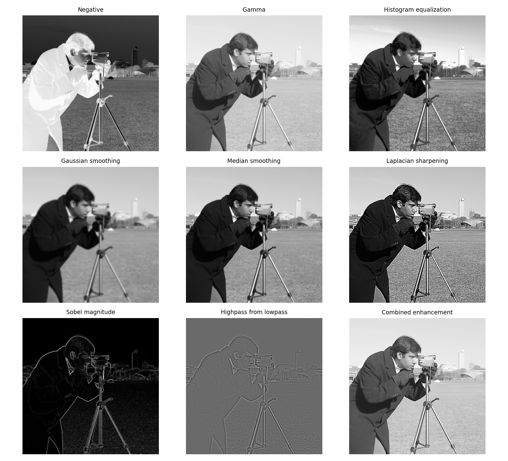

# Digital Image Processing — Chapter 3 Toolbox

### Intensity Transformations and Spatial Filtering

An **unofficial educational Python toolbox** for teaching and experimenting with the main concepts of Chapter 3 of *Digital Image Processing* by Rafael C. Gonzalez and Richard E. Woods.

The project combines a small graphical interface with independent, readable Python implementations of intensity transformations, histogram processing, spatial filtering, smoothing, sharpening, gradient operators, and several useful extensions beyond the textbook.

> **Teaching goal:** students should be able to change an image, select an algorithm, modify its parameters, and immediately connect the mathematical operation with its visual effect.



---

## Features

- Simple **Tkinter GUI** for interactive experiments.
- Load built-in standard images or browse for any local image.
- Separate reference-image selection for histogram matching.
- Side-by-side input/output visualization.
- Histogram display and output saving.
- Parameter controls for each algorithm.
- **Standalone algorithm files**: each processing method can also be run directly from the command line.
- Standard scientific Python libraries: **NumPy, SciPy, scikit-image, Pillow, and Matplotlib**.
- Educational sample images plus synthetic patterns such as ramps and zone plates.
- Smoke tests covering all registered algorithms.
- Persian documentation describing options, parameters, and their relation to Chapter 3.

---

## Main topics covered

### 1. Intensity transformations

Implemented examples include:

- Image negative
- Log transform
- Inverse-log / exponential transform
- Gamma (power-law) transform
- Contrast stretching
- Piecewise-linear transformation
- Threshold transformation
- Intensity-level slicing
- Bit-plane slicing
- Sigmoid transformation
- `asinh` transformation
- Window/level transformation

Several transformations in this group are intentionally included **beyond the textbook** because they are useful for understanding the general point transformation model

\[
s = T(r).
\]

They also provide practical examples from medical imaging, visualization, contrast manipulation, and nonlinear tone mapping.

### 2. Histogram processing

- Global histogram equalization
- Local histogram equalization
- Histogram matching/specification
- CLAHE
- Local-statistics enhancement

### 3. Fundamentals of spatial filtering

- Correlation
- Convolution
- Cascaded convolution
- Separable Gaussian filtering

The separable and cascaded implementations are included to make the computational meaning of kernel decomposition and equivalent composite filters visible in code.

### 4. Smoothing filters

- Box / averaging filter
- Gaussian filter
- Median filter
- Bilateral filter
- Order-statistic filters

### 5. Sharpening and derivative operators

- Laplacian sharpening
- Unsharp masking
- High-boost filtering
- Roberts gradient
- Prewitt gradient
- Sobel gradient
- Scharr gradient

### 6. Highpass, bandreject, and bandpass construction

- Highpass filter derived from a lowpass filter
- Bandpass / bandreject examples

### 7. Combined enhancement pipeline

A multi-stage enhancement example combines complementary operations such as Laplacian sharpening, gradient information, smoothing, masking, and nonlinear intensity adjustment. It is intended to demonstrate how individual tools from the chapter can be assembled into a practical processing pipeline.

---

## Quick start — Windows

### Option A: automatic setup and launch

1. Install **Python 3.10+**.
2. Download or clone this repository.
3. Double-click:

```text
INSTALL_AND_RUN.bat
```

The script creates a local `.venv`, installs the required packages, checks Tkinter, and launches the GUI.

For later runs, use:

```text
RUN_TOOLBOX.bat
```

or:

```text
RUN_TOOLBOX.cmd
```

### Option B: command line

```bat
git clone https://github.com/YOUR-USERNAME/digital-image-processing-ch3-toolbox.git
cd digital-image-processing-ch3-toolbox
SETUP_ENV.bat
RUN_TOOLBOX.bat
```

Replace `YOUR-USERNAME` with your GitHub username.

---

## Manual installation — Windows, Linux, or macOS

Create a virtual environment and install the dependencies:

```bash
python -m venv .venv
```

Activate it.

Windows:

```bat
.venv\Scripts\activate
```

Linux/macOS:

```bash
source .venv/bin/activate
```

Then install the packages and start the GUI:

```bash
python -m pip install --upgrade pip
python -m pip install -r requirements.txt
python app.py
```

> On some Linux distributions, Tkinter must be installed separately using the operating-system package manager.

---

## Running algorithms independently

Every algorithm is stored in its own file under `algorithms/`. This makes the code suitable for classroom discussion, assignments, and direct experimentation without the GUI.

Examples:

```bat
.venv\Scripts\python.exe algorithms\gamma_transform.py --params gamma=0.4 --output outputs\gamma.png
```

```bat
.venv\Scripts\python.exe algorithms\median_filter.py --params size=5 --output outputs\median.png
```

The shared `_common.py` file contains only common I/O and command-line helpers; the main processing logic remains in the named algorithm file.

---

## Testing

Run the smoke test from Windows:

```text
RUN_SMOKE_TEST.bat
```

or directly:

```bash
python tests/smoke_test.py
```

A demonstration contact sheet can be generated with:

```bash
python demo_all.py
```

---

## Repository structure

```text
.
├── app.py                         # Tkinter GUI
├── algorithm_registry.py          # GUI-to-algorithm registry
├── image_sources.py               # Standard/synthetic image sources
├── algorithms/                    # Independent processing modules
├── samples/                       # Redistributable sample images
├── tests/                         # Smoke tests
├── outputs/                       # Generated results / demo sheet
├── OPTIONS_GUIDE_FA.md            # Persian guide to all GUI options
├── CHAPTER3_MAPPING_FA.md         # Mapping between code and chapter topics
├── GITHUB_REFERENCES.md           # Upstream scientific-library references
├── TECHNICAL_NOTES.md             # Implementation notes
├── LICENSE_NOTE.md                # Notes on code/images/book material
├── requirements.txt
├── SETUP_ENV.bat
├── INSTALL_AND_RUN.bat
├── RUN_TOOLBOX.bat
└── RUN_SMOKE_TEST.bat
```

---

## Documentation

For Persian-language teaching material, see:

- [`OPTIONS_GUIDE_FA.md`](OPTIONS_GUIDE_FA.md) — explanation of algorithms, options, parameters, suggested values, and applications.
- [`CHAPTER3_MAPPING_FA.md`](CHAPTER3_MAPPING_FA.md) — correspondence between the source files and Chapter 3 topics.
- [`GITHUB_REFERENCES.md`](GITHUB_REFERENCES.md) — official upstream repositories and APIs used by the project.
- [`TECHNICAL_NOTES.md`](TECHNICAL_NOTES.md) — implementation details.

---

## Standard images and external libraries

The project uses established open-source scientific libraries rather than reimplementing optimized low-level routines unnecessarily. Examples include `scipy.ndimage` and modules from `scikit-image`.

Bundled third-party sample images were selected from sources documented as CC0, public domain, or having no known copyright restrictions. See [`samples/SAMPLE_LICENSES.md`](samples/SAMPLE_LICENSES.md).

Additional standard images exposed through the GUI are loaded at runtime from the installed `scikit-image` package and are not redistributed here.

---

## Relationship to the textbook

This repository is an **independent, unofficial educational companion**. It is not affiliated with or endorsed by Pearson, Rafael C. Gonzalez, or Richard E. Woods.

The repository is intended to help students understand the algorithms and equations through executable examples. **Scans, figures, or other copyrighted artwork from the textbook should not be redistributed in this public repository.** If a local teaching-note or reference file contains material for which redistribution rights are unclear, keep it outside the public Git repository.

---

## Suggested classroom workflow

A useful sequence for each topic is:

1. Introduce the mathematical relation.
2. Run the corresponding standalone Python file on a standard image.
3. Change one parameter at a time in the GUI.
4. Compare the input/output images and histograms.
5. Ask students to explain *why* the observed change follows from the equation.
6. Apply the same algorithm to a different image and discuss where the method succeeds or fails.

This keeps the emphasis on the connection between **equation → algorithm → parameters → visual result → application**.

---

## فارسی

این مخزن یک جعبه‌ابزار آموزشی برای مبحث **Intensity Transformations and Spatial Filtering** است. هدف آن این است که دانشجو علاوه بر دیدن رابطه‌های ریاضی، همان عملیات را به‌صورت کد مستقل و همچنین در یک GUI ساده اجرا کند و اثر تغییر پارامترها را مستقیماً روی تصویر ببیند.

راهنمای کامل گزینه‌ها و پارامترها در فایل [`OPTIONS_GUIDE_FA.md`](OPTIONS_GUIDE_FA.md) و ارتباط فایل‌های کد با مباحث فصل در [`CHAPTER3_MAPPING_FA.md`](CHAPTER3_MAPPING_FA.md) آمده است.

برای استفاده عمومی در GitHub، بهتر است فایل PDF کتاب، اسکن شکل‌های کتاب، یا هر فایل مرجعی که مجوز بازنشر آن مشخص نیست در مخزن عمومی قرار نگیرد.

---

## Citation / acknowledgement

If you use this toolbox in a course, project, or teaching material, a simple acknowledgement of the repository is appreciated. When discussing the underlying image-processing theory, cite the textbook or the original scientific references appropriate to your course.

---

## License

The project currently includes [`LICENSE_NOTE.md`](LICENSE_NOTE.md) describing code, dependencies, and image-source considerations. Before a public release, choose an explicit license for **your original source code** (for example MIT or BSD-3-Clause) and add it as a top-level `LICENSE` file. Third-party assets remain subject to their respective licenses.
